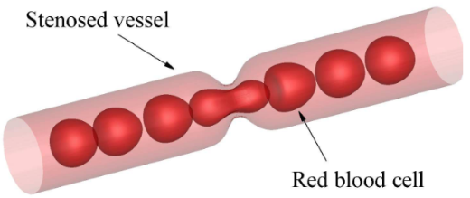
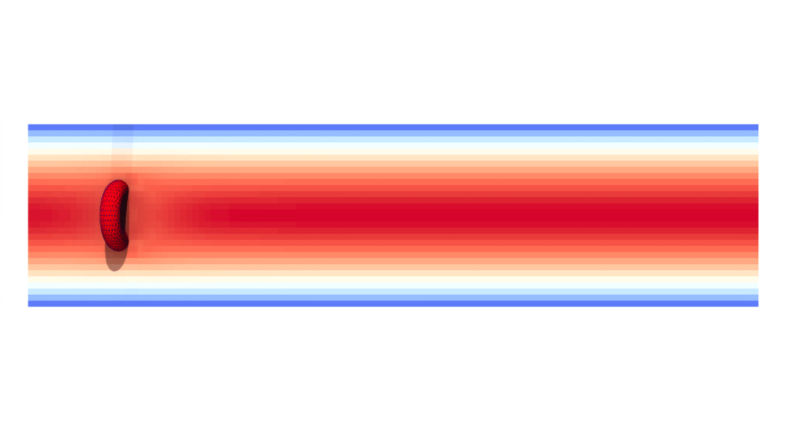
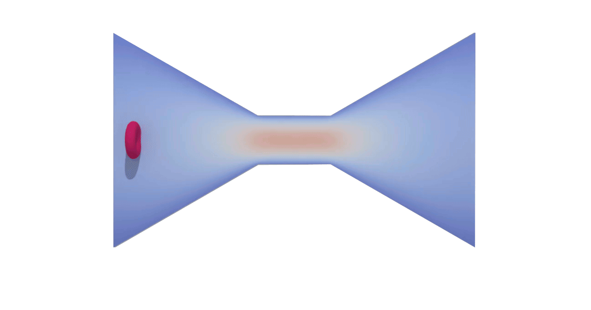
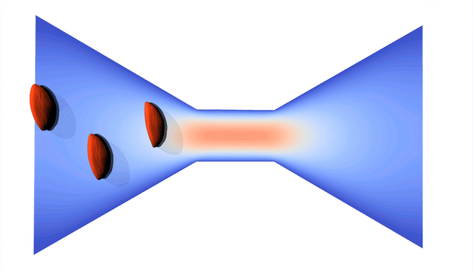

# RBC Deformation Study Through Microchips

This repository should contain the Mpacts-OpenFoam simulations for the **Immersed Boundary Method (IBM)** coupling between an Mpacts object (Red Blood cell in this case) and a laminar fluid. Due to Mpacts code belongs to KU Leuven, this repository only contains the geometries and the OpenFoam Laminar fluid code. 



 **Objectives**

 The aim of these simulations is to compute the flow and deformation of synthetic discretized cells using a CFD coupling via the IBM.

**Content**

- Different geometries where the cell flow through in STL format [Geometries](Geometries).
- In [Simulation_files](Simulation_files) :
    - OpenFoam file to visualize the fluid on paraview (.foam extension)
    - 0 folder, where the initial values are set
    - system folder, needed for OpenFoam
    - constant folder, needed for OpenFoam


**Brief Explanation**

In these simulations, the interaction between the cell and the fluid for Planar Poiseulle flow conditions is computed. The velocity of a Poiseuille flow inside a cylinder taking $z$ as the direction of the flow can be calculated as:

$$
v_z (r) = \dfrac{\Delta P}{4 \eta L} (R^2 - r^2)
$$

considering $R$ as the radius of the channel, $\Delta P$ as the pressure drop along the pipe, $L$ as the length of the channel and $\eta$ as the dynamic viscosity. For different geometries see [PoiseuilleFlow](https://en.wikipedia.org/wiki/Hagen%E2%80%93Poiseuille_equation). For more information on how to compute Poiseuille Flow in OpenFoam visit: [Tutorial_Poiseuille](http://www.wolfdynamics.com/wiki/tut_hagen_poiseuille.pdf)

The coupling handles the force from the cells and the velocity from the fluid to build up a bridge between CFD and cells. Via Lagrangian (Mpacts)-Eulerian (CFD) description the simulation is able to solve Navier-Stokes equation, update the velocity field, transfer this to the Lagrangian points, interpolate the new positions of the MPACTS nodes, calculate the forces from the nodes, couple back this forces to the Eulerian fluid and use them in the next timestep to solve again N-S equations.

**How to use**

Here the different steps to run the simulation are explained:

1. Stay in **Simulation_files** to run the commands and visualize the results. First of all, generate a blockMesh:
```bash
    blockMesh
```
2. Copy paste the **triSurface** from [geometries](../Geometries) folder in **constant**. Ensure that the required .stl files used to define all the boundaries are in the folder.
*
    **Note:** If one wants to design complex geometries, the walls, outlet and inlet have to be properly designed and exported in STL format. Follow this [tutorial](https://www.youtube.com/watch?v=ZuGnO6VGeXE&t=258s) to learn how to do it in **Freecad**.

3. Execute surfaceFeatureExtract and snapyHexMesh:

````bash
    surfaceFeatureExtract
    snapyHexMesh -overwrite
````
*
    **Note:** snapyHexMesh can complain about the **LocationInMesh**. The STL geometry has to be inside the blockMesh (or even touching the edges) and locationInMesh has to be a point inside the BlockMesh created at step 1.


4. Finally, the Mpacts code should be executed to release the cells in the CFD system. The solver uses [pimpleFoam](https://www.openfoam.com/documentation/user-guide/a-reference/a.1-standard-solvers)


**Results**

A possible visualization of the outcome in Paraview would be like this:

1. Cell flowing through a cylinder



2. Cell flowing through a constriction



3. Multiple cells!


